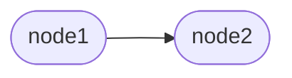
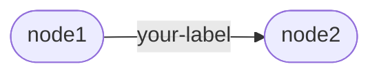

# Building Blocks

At the core of Artigraph are [nodes](#nodes) and [links](#links). Nodes are the vertices
of the graph and links are the edges that connect them. Links, the graph edges in
Artigraph, are directed (having a `source_id` and a `target_id`) and may have an
optional label that describes the relationship between the nodes they connect.

Nodes which have data associated with them are called [artifacts](#artifacts). Artifacts
are the primary way you'll store information in Artigraph. You can organize artifacts
into [models](#models) which give structure to the data they contain.

## Nodes

The [Node][artigraph.Node] class forms the backbone of the graphs you'll create with
Artigraph. It represents a single vertex in a graph. You can create a node by
instantiating the class directly:

```python
import artigraph as ag

node = ag.Node()
```

This won't immediately save the node to the database. To do that, you'll need to call
[write_one()][artigraph.write_one].

```python
ag.write_one(node)
```

Or, if you need to write more than one node, you can pass
[write_many()][artigraph.write_many] a sequence of nodes.

```python
node1 = ag.Node()
node2 = ag.Node()
ag.write([node1, node2])
```

## Links

[Link][artigraph.Link] objects are the edges that connect nodes in a graph. To create
one you'll need at least two node. You can then pass their IDs to the constructor:

```python
import artigraph as ag

node1 = ag.Node()
node2 = ag.Node()

link = ag.Link(source_id=node1.graph_id, target_id=node2.graph_id)
```

Which will form the following relationship:



Node links can also have a label that describes the relationship between the nodes:

```python
link = ag.Link(
    source_id=node1.graph_id,
    target_id=node2.graph_id,
    label="your-label",
)
```

That have a labeled edge between them:



You can then write them all to the database:

```python
ag.write([node1, node2, link])
```

## Artifacts

An [Artifact][artigraph.Artifact] is a node in the graph that additionally has a value.
Without specifying anything extra, values are limited to byte strings:

```python
import artigraph as ag

artifact = ag.Artifact(value=b"Hello, world!")
```

To store other types of data, you'll need to declare a [serializer](./serializers.md):

```python
json_artifact = ag.Artifact(
    value={"hello": "world"},
    serializer=ag.json_serializer,
)
```

You can then write the artifact to the database:

```python
ag.write_one(artifact)
```

As with nodes, you can relate them with each other or with other nodes using node links:

```python
node = ag.Node()
artifact = ag.Artifact(value=b"Hello, world!")
link = ag.Link(source_id=node.graph_id, target_id=artifact.graph_id)

ag.write([node, artifact, link])
```

Some data is too large to store directly in the database. For that, you can specify a
[storage](./storage.md) location:

```python
file_storage = ag.FileSystemStorage("path/to/storage/dir")

large_artifact = ag.Artifact(
    value={"really": "big", "data": "here"},
    serializer=ag.json_serializer,
    storage=file_storage,
)
```

## Models

A [GraphModel][artigraph.GraphModel] gives structure to the data in your artifacts. The
easiest way to create one is using the built-in [@dataclass][artigraph.dataclass]
decorator, though [other model types](./models.md#built-in-models) exist. The only
difference between this decorator and the standard library version is that it must be
used on a subclass of `GraphModel` which requires a version (which will be discussed
later). With that in mind, you can define a model like so:

```python
import artigraph as ag


@ag.dataclass
class Person(ag.GraphModel, version=1):
    name: str
    age: int
```

You can then create an instance of the model and write it to the database:

```python
person = Person(name="John Doe", age=42)
ag.write_one(person)
```

You'll note here that you didn't have to specify a serializer for non-bytes values.
That's because, by default, the fields of a dataclass `GraphModel` are serialized using
the built-in JSON serializer. For fields that are not JSON-serializable or which require
external storage, you'll need to annotate them with this information using
[`typing.Annotated`](https://docs.python.org/3/library/typing.html#typing.Annotated):

```python
from datetime import datetime
from typing import TypeVar, Annotated

import artigraph as ag

T = TypeVar("T")

DateTime = Annotated[datetime, ag.datetime_serializer]
StoreFile = Annotated[T, ag.FileSystemStorage("path/to/storage/dir")]


@ag.dataclass
class Person(ag.GraphModel, version=1):
    name: str
    age: int
    birthday: DateTime
    photo: StoreFile[bytes]


person = Person(
    name="John Doe",
    age=42,
    birthday=datetime(1979, 1, 1),
    photo=b"a really big photo",
)

ag.write_one(person)
```
