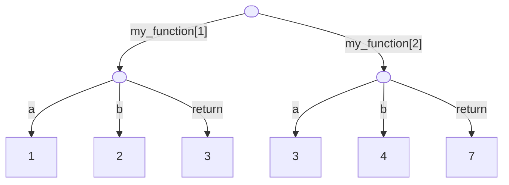
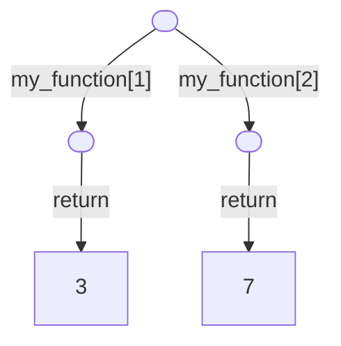

# Creating Graphs

While you can already create graphs out of the basic
[building blocks](./building-blocks.md) and [operations](./common-operations.md)
Artigraph provides, it can be tedious to do so.

## Linker Context

Artigraph provides a more convenient way to create graphs likes this with a
[Linker][artigraph.Linker]. A linker is a context manager which accepts a node (and an
optional label) that allows you to [link()][artigraph.Linker.link] data to it. So
instead of writing:

```python
import artigraph as ag


@ag.dataclass
class MyModel(ag.GraphModel, version=1):
    some_value: int
    another_value: dict[str, str]


node = ag.Node()
model = MyModel(some_value=42, another_value={"foo": "bar"})
link = ag.Link(source_id=node.graph_id, target_id=model.graph_id, label="my_model")
ag.write_many([node, model, link])
```

You can instead write the latter portion as:

```python
with ag.Linker(ag.Node()) as root:
    root.link(
        MyModel(some_value=42, another_value={"foo": "bar"}),
        label="my_model"
    )
```

The data you link to a node doesn't have to be a model. You can link anything that your
currently registered [serializers](./serializers.md) know how to serialize. For example,
you can link a dictionary since Artigraph comes with a built-in JSON serializer:

```python
with ag.Linker(ag.Node()) as root:
    root.link({"foo": "bar"}, label="my_dict")
```

`Linker`s also allow you to attach data to nodes "at a distance" because you can always
access the currently active linker with the [current_linker()][artigraph.current_linker]
function. This allows you to write code like this:

```python
def create_model():
    model = MyModel(some_value=42, another_value={"foo": "bar"})
    current_linker().link(model, label="my_model")
    return model


with ag.Linker(ag.Node()) as root:
    create_model()
```

## Linked Functions

In addition to the [linker](#linkers) context manager, Artigraph provides a
[linked()][artigraph.linked] decorator that allows you to link the inputs and outputs of
a function to a node. This is useful for tracing the execution of functions in a data
pipeline.

```python
import artigraph as ag


@ag.linked()
def my_function(a: int, b: int) -> int:
    return a + b


with ag.Linker(ag.Node()) as root:
    my_function(1, 2)
    my_function(3, 4)
```

The above code will create the following graph:



!!! note

    Linked functions **must** be called within a [`Linker`][artigraph.Linker] context manager.

If you want to limit what's saved by a linked function, you can pass either `include` or
`exclude` arguments to the decorator. These arguments are one or more strings that
specify whether to save arguments or the return value. For example, to only save the
return value of a function, you can write:

```python
@ag.linked(include="return")
def my_function(a: int, b: int) -> int:
    return a + b
```

Doing so will create the following graph:


