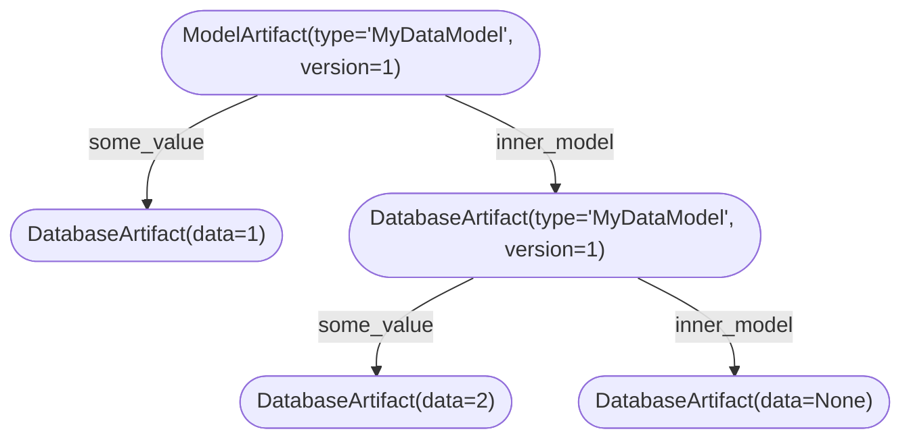

# Database Schema

Artigraph defines a graph database within [SQLAlchemy](https://www.sqlalchemy.org/).

## Link

Linkages between [nodes](#node) are stored in the `artigraph_link` table whose base set
of columns are describe by the [OrmLink][artigraph.OrmLink] class:

| Column      | Type                | Description                         |
| ----------- | ------------------- | ----------------------------------- |
| `id`        | `UUID`              | The primary key of the link.        |
| `source_id` | `UUID`              | The primary key of the source node. |
| `target_id` | `UUID`              | The primary key of the target node. |
| `label`     | `String` (nullable) | The label of the link.              |

!!! note

    Labels are not required, but if supplied must be unique for a given source node.

## Node

Most data in Artigraph is stored in a single `artigraph_node` table whose base set of
columns are describe by the [OrmNode][artigraph.OrmNode] class:

| Column            | Type       | Description                                                  |
| ----------------- | ---------- | ------------------------------------------------------------ |
| `id`              | `UUID`     | The primary key of the node.                                 |
| `node_type`       | `String`   | The type of the node (comes from its `polymorphic_identity`) |
| `node_created_at` | `DateTime` | The time the node was created.                               |
| `node_updated_at` | `DateTime` | The time the node was last updated.                          |

Subclasses of `OrmNode` utilize [single table inheritance](#single-table-inheritance) to
extend the table. As a result of this inheritance strategy, and to avoid name
collisions, `OrmNode`'s columns are prefixed with `node_`. Subclasses of `OrmNode` ought
to do the same. For example, the [OrmArtifact][artigraph.OrmArtifact] class defines its
columns with an `artifact_` prefix.

### Node Inheritance

Here's an example of what a different `OrmNode` subclass might look like:

```python
import artigraph as ag
from sqlalchemy import UniqueConstraint
from sqlalchemy.declarative import Mapped, mapped_column


class MyOrmNode(ag.OrmNode):
    __mapper_args__ = {"polymorphic_identity": "my_node"}
    __table_args = (UniqueConstraint("node_source_id", "my_node_label"),)
    my_node_label: Mapped[str] = mapped_column(nullable=True)
```

Note that even though the type annotation on `my_node_label` is `str`, the column is
marked as nullable. This is because all `OrmNode` subclasses are stored in the same
table and, as such, not all columns will be populated by all rows. Making a column
non-nullable will cause other `OrmNode` class instances to fail to save to the database
since they lack a non-nullable column from another subclass.

Under the hood `artigraph` does several somewhat magical things. First, it inspects the
`__mapper_args__` for the `polymorphic_identity` and saves that as a class attribute
(e.g. `MyNode.polymorphic_identity = "my_node"`). Second, since `__table_args__` cannot
typically be defined on subclasses without a `__tablename__`, as all subclasses of
`OrmNode` must to use single table inheritance, Artigraph shuttles the `__table_args__`
to the `OrmNode` class. Lastly, artigraph looks at any foreign keys and tries to
determine what order they should be created in to avoid foreign key constraint
violations.

!!! note

    Circular foreign keys are not supported at this time.

### Single Table Inheritance

Artigraph uses
[single table inheritance](https://docs.sqlalchemy.org/en/14/orm/inheritance.html#single-table-inheritance)
(STI) to store all data in a single table. This comes with advantages and disadvantages
compared to
[concrete table inheritance](https://docs.sqlalchemy.org/en/20/orm/inheritance.html#concrete-table-inheritance).
The primary advantage of STI is that the database schema is drastically simplified since
there's only one table to manage - queries can avoid joins and thus be more performant.
The disadvantages of STI come from a lack of separation - making independent schema
changes may be challenging.

It's worth keeping these tradeoffs in mind as you extend Artigraph. The main way to
mitigate the disadvantages of STI is to keep the number of `OrmNode` subclasses to a
minimum. Thankfully, the base primitives of Artigraph are powerful enough to support a
wide variety of use cases. In general, if you find yourself needing to add a new

!!! note

    Thankfully most modern databases do not suffer from size issues if a table is
    sparse. For example, in PostgreSQL a null bitmap is used to mark which columns
    are null for any row with at least one null value. As such, the size of a sparse
    row is identical to one that is well (but not completely) populated.

### Artifact

[OrmArtifact][artigraph.OrmArtifact] is a subclass of [`OrmNode`](#node) that defines a
set of columns that are shared by all artifacts. It does not contain data or describe
where data may be found. Its columns are:

| Column                | Type     | Description                                                |
| --------------------- | -------- | ---------------------------------------------------------- |
| `artifact_serializer` | `String` | The name of the serializer used to serialize the artifact. |

Of note is the `artifact_serializer` which maps to a [serializer](serializers.md) by
name.

#### Database Artifact

[OrmDatabaseArtifact][artigraph.OrmDatabaseArtifact] is a subclass of
[`OrmArtifact`](#artifact) that stores data directly in the database. It defines a
single column for that purpose:

| Column                   | Type    | Description               |
| ------------------------ | ------- | ------------------------- |
| `database_artifact_data` | `Bytes` | The data of the artifact. |

#### Model Artifact

[OrmModelArtifact][artigraph.OrmModelArtifact] is a subclass of
[`DatabaseArtifact`](#database-artifact) that stores the root node of a
[model](./models.md).

| Column                     | Type  | Description                |
| -------------------------- | ----- | -------------------------- |
| `model_artifact_type_name` | `str` | The name of the model type |
| `model_artifact_version`   | `int` | The version of the model   |

#### Remote Artifact

[OrmRemoteArtifact][artigraph.OrmRemoteArtifact] is a subclass of
[`OrmArtifact`](#artifact) that represents an artifact that is stored somewhere else
other than the database. Since the data itself is stored elsewhere, all that is stored
in the database is a pointer to the artifact. To do this it defines:

| Column                     | Type     | Description                                         |
| -------------------------- | -------- | --------------------------------------------------- |
| `remote_artifact_storage`  | `String` | The name of the storage backend.                    |
| `remote_artifact_location` | `String` | The location of the data in in the storage backend. |

The `remote_artifact_storage` column maps to a [storage backend](storage.md) by name.

## Graph Models

The [dataclass-like usage of `GraphModel`](./building-blocks.md#models) belies the fact
that its underlying implementation builds atop [database](#database-artifact),
[remote](#remote-artifact) and [model](#model-artifact) artifacts. Under the hood, the
hierarchy of a `GraphModel` and its fields are replicated in the database. So saving a
`GraphModel` like the one below:

```python
import artigraph as ag


@ag.dataclass
class MyDataModel(ag.GraphModel, version=1):
    some_value: int
    inner_model: MyDataModel | None = None


my_data = MyDataModel(some_value=1, inner_model=MyDataModel(some_value=2))
ag.write_one(my_data)
```

Will result in the following graph being created in the database


