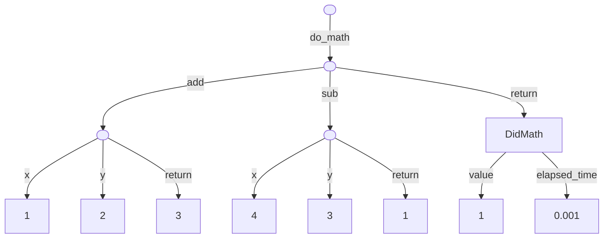
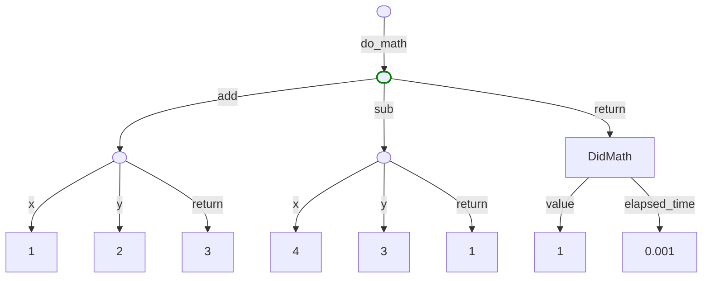
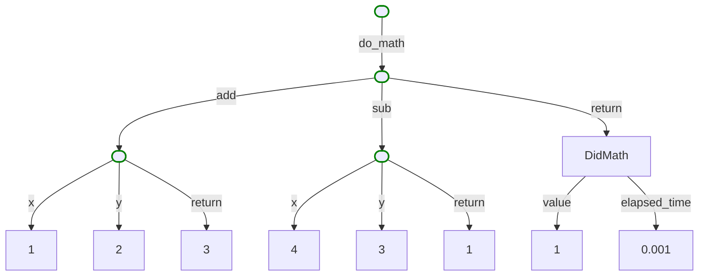
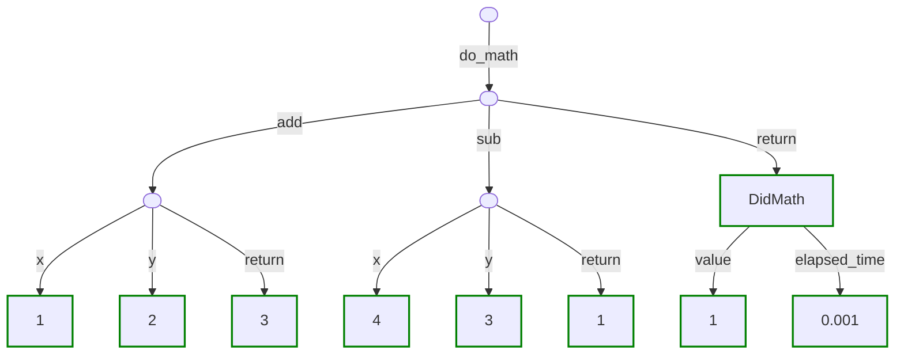
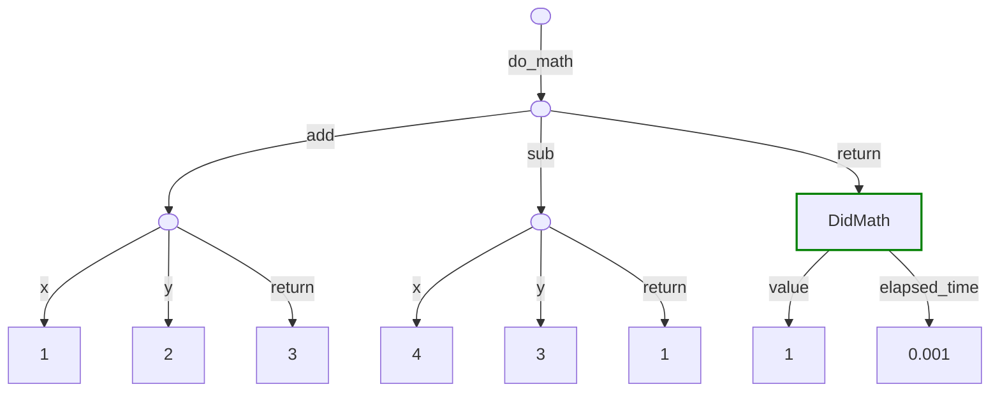
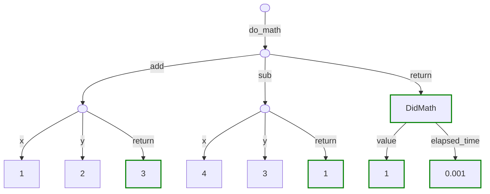

# Filtering

Artigraph allows you to inspect graphs using filters. Filters can be composed together
to create a wide variety of complex queries so the examples below will show just some of
the ways they can be used. They'll assume the following code
[graph structure](#example-graph) and highlight in
<span style="color:green">green</span>, links or nodes that are selected by the
described filters.

```python
import time

import artigraph as ag
from artigraph.extras.networkx import create_graph
from artigraph.extras.plotly import figure_from_networkx

ag.set_engine("sqlite+aiosqlite:///:memory:", create_tables=True)


@ag.trace_function()
def add(x: int, y: int) -> int:
    return x + y


@ag.trace_function()
def sub(x: int, y: int) -> int:
    return x - y


@ag.trace_function()
def do_math() -> "DidMath":
    start = time.time()
    result = sub(4, add(1, 2))
    elapsed_time = time.time() - start
    return DidMath(result, elapsed_time)


@ag.dataclass
class DidMath(ag.GraphModel, version=1):
    value: int
    elapsed_time: float


with ag.Linker(ag.Node()) as root:
    do_math()
graph = create_graph(root.node)
fig = figure_from_networkx(graph)
fig.show()
```

<div id="example-graph"></div>



## Base Filter

[Filter][artigraph.Filter] is the base class for all filters. A filter is simply a
dataclass-like object that implements a [compose()][artigraph.Filter.compose] method
that takes and returns a SQLAlchemy expression object. Inside the
[compose()][artigraph.Filter.compose] method you can modify the expression object to add
conditions to the query. For example, the following filter will only select nodes that
have a parent:

```python
import artigraph as ag

from sqlalchemy import select


class MyFilter(ag.Filter):
   must_have_parent: bool = False

   def compose(self, expr):
         if self.must_have_parent:
              expr &= ag.OrmNode.id.in_(select(ag.OrmLink.source_id))
         return expr
```

You can then compose multiple filters using the `&` and `|` operators:

```python
await read_node(NodeFilter(id=2) & MyFilter(must_have_parent=True))
```

## Node Filter

A [NodeFilter][artigraph.NodeFilter] is a higher-level filter that allows you to compose
common node-related filter conditions together. It is also the base class for filters
that apply to node subclasses such as [ArtifactFilter][artigraph.ArtifactFilter] and
[ModelFilter][artigraph.ModelFilter]. It can be used to select nodes based on their
properties, relationships, or type. For example you can select by node id:

```python
import artigraph as ag

ag.read(ag.Node, ag.NodeFilter(label="do_math"))
```



## Node Type Filter

The [NodeTypeFilter][artigraph.NodeTypeFilter] allows you to select nodes based on their
type. By default, it will select all nodes that are instances of the given type or any
of its subclasses. You can change this behavior by setting `subclasses=False` to only
select nodes that are instances of the given type.

```python
import artigraph as ag

await read(Node, NodeTypeFilter(type=ag.OrmNode, subclasses=False))
```



## Artifact Filter

The [ArtifactFilter][artigraph.ArtifactFilter] allows you to select nodes which inherit
from [Artifact][artigraph.Artifact]. It accomplished this by setting a default value for
[NodeFilter.node_type][artigraph.NodeFilter.node_type]. For example, you can select
artifacts by their label:

```python
import artigraph as ag

ag.read(ag.Artifact, ag.ArtifactFilter())
```



## Model Filter

The [ModelFilter][artigraph.ModelFilter] allows you to select nodes which inherit from
[GraphModel][artigraph.GraphModel]. It accomplishes this by setting a default value for
[NodeFilter.node_type][artigraph.NodeFilter.node_type]. You can use this to select
models by their type.

```python
import artigraph as ag

ag.read(ag.GraphModel, ag.ModelFilter(model_type=DidMath))
```



## Value Filter

The [ValueFilter][artigraph.ValueFilter] allows you to select individual values by
comparing them to one or more given values. It does not allow you filter nodes directly
but might be useful to do so indirectly by comparing values of a node's properties. Many
other filters support using [ValueFilter][artigraph.ValueFilter]s. For example
[NodeFilter.id][artigraph.NodeFilter.id] can be a [ValueFilter][artigraph.ValueFilter]
instead of an integer:

```python
import artigraph as ag

ag.read(ag.Artifact, ag.ArtifactFilter(label=ValueFilter(not_in=["x", "y"])))
```


