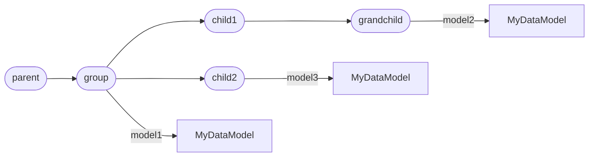
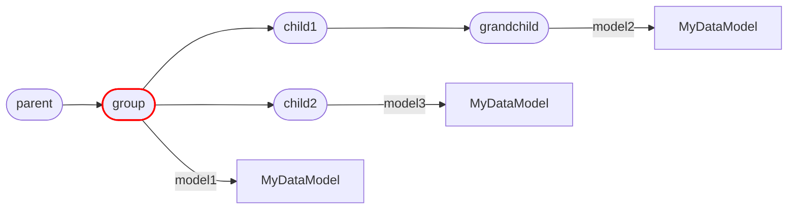
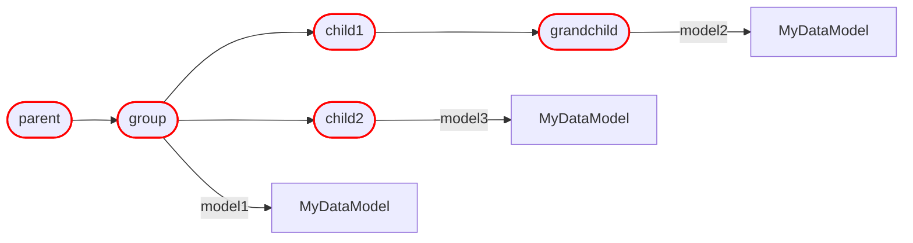
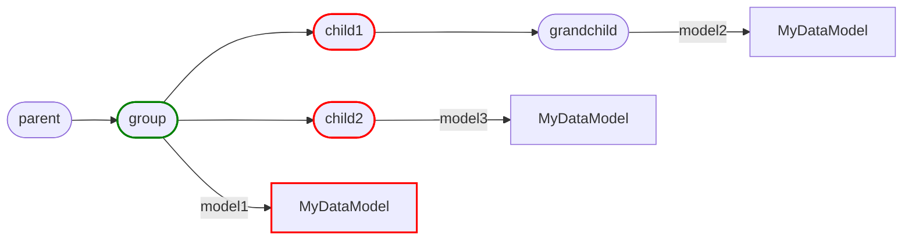
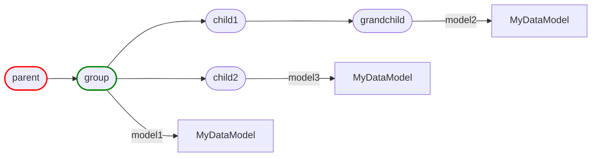
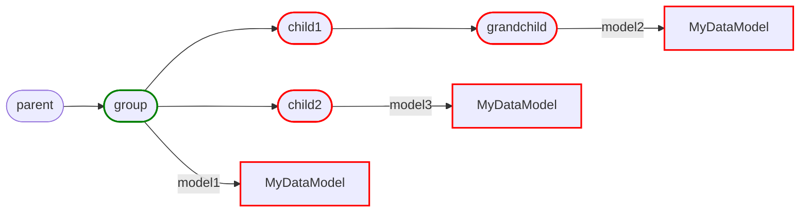
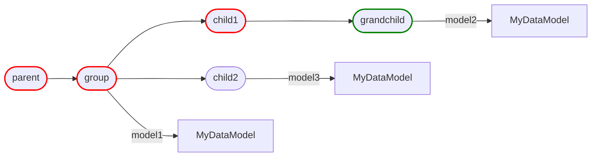
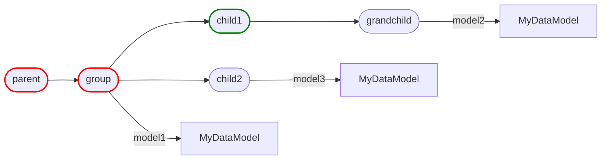
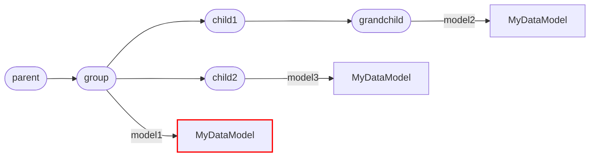
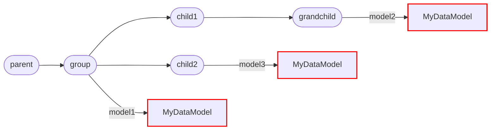

# Queries

Artigraph makes it easy to inspect and operate on the graph of nodes defined by the
underlying [database schema](schema.md) using [Filter][artigraph.Filter]s. This section
does not attempt to describe all the ways in which you can query the graph but rather to
provide a few examples of how to use the available filters.

## Example Graph

The examples below will assume the following code and graph structure where nodes
highlighted <span style="color:green">green</span> are those used in the query and
<span style="color:red">red</span> highlights show those that would be returned.

```python
from artigraph import ModelGroup, new_node


@dataclass
class MyDataModel(DataModel, version=1):
    some_value: int
    another_value: str


async with ModelGroup(new_node(node_id=1)) as parent:
    async with ModelGroup(new_node(node_id=2)) as group:
        node.add_model("model1", MyDataModel(...))
        async with ModelGroup(new_node(node_id=3)) as child1:
            async with ModelGroup(new_node(node_id=4)) as grandchild:
                grandchild.add_model("model2", MyDataModel(...))
        async with ModelGroup(new_node(node_id=5)) as child2:
            child2.add_model("model3", MyDataModel(...))
```

<div id="span-graph"></div>



## Filter

A [Filter][artigraph.Filter] is a base class for all filters. A filter is simply a class
that implements an [apply()][artigraph.Filter.apply] method that takes a SQLAlchemy
`Select`, `Update`, or `Delete` object and applies the filter to it.

### Node Filter

A [NodeFilter][artigraph.NodeFilter] allows you to select all [Node][artigraph.Node]
subclasses based on their properties.

#### Select by ID

```python
from artigraph import NodeFilter, read_node

await read_node(NodeFilter(node_id=2))
```



### Node Type Filter

The [NodeTypeFilter][artigraph.NodeTypeFilter] allows you to select nodes based on their
type. By default, it will select all nodes that are instances of the given type or any
of its subclasses. You can change this behavior by setting `subclasses=False` to only
select nodes that are instances of the given type.

```python
from artigraph import Node, NodeFilter, NodeTypeFilter, read_nodes

await read_nodes(NodeFilter(node_type=NodeTypeFilter(type=Node, subclasses=False)))
```



### Relationship Filter

The [NodeRelationshipFilter][artigraph.NodeRelationshipFilter] allows you to select
nodes based on their relationships to other nodes.

#### Select Children

```python
from artigraph import NodeFilter, NodeRelationshipFilter, read_nodes

await read_nodes(NodeFilter(relationship=NodeRelationshipFilter(child_of=1)))
```



#### Select Parents

```python
from artigraph import NodeFilter, NodeRelationshipFilter, read_nodes

await read_nodes(NodeFilter(relationship=NodeRelationshipFilter(parent_of=2)))
```



#### Select Descendants

```python
from artigraph import NodeFilter, NodeRelationshipFilter, read_nodes

await read_nodes(NodeFilter(relationship=NodeRelationshipFilter(descendant_of=2)))
```



#### Select Ancestors

```python
from artigraph import NodeFilter, NodeRelationshipFilter, read_nodes

await read_nodes(NodeFilter(relationship=NodeRelationshipFilter(ancestor_of=4)))
```



### Value Filter

The [ValueFilter][artigraph.ValueFilter] allows you to select individual values by
comparing them to one or more given values. It does not allow you filter nodes directly
but might be useful to do so indirectly by comparing values of a node's properties. Many
other filters support using [ValueFilter][artigraph.ValueFilter]s. For example
[NodeFilter.node_id][artigraph.NodeFilter.node_id] can be a
[ValueFilter][artigraph.ValueFilter] instead of an integer:

```python
from artigraph import NodeFilter, ValueFilter, read_nodes

await read_nodes(NodeFilter(node_id=ValueFilter(lt=3)))
```



### Artifact Filter

The [ArtifactFilter][artigraph.ArtifactFilter] allows you to select nodes which inherit
from [BaseArtifact][artigraph.BaseArtifact]. It accomplished this by setting a default
value for [NodeFilter.node_type][artigraph.NodeFilter.node_type].

### Select by Label

```python
from artigraph import ArtifactFilter, read_artifacts

await read_artifacts(ArtifactFilter(artifact_label="model1"))
```



### Model Filter

The [ModelFilter][artigraph.ModelFilter] allows you to select nodes which inherit from
[ModelArtifact][artigraph.ModelArtifact]. It accomplished this by setting a default
value for [NodeFilter.node_type][artigraph.NodeFilter.node_type].

### ModelTypeFilter

The [ModelTypeFilter][artigraph.ModelTypeFilter] allows you to select nodes based on
their [BaseModel][artigraph.BaseModel] type. By default, it will select all nodes that
are instances of the given type or any of its subclasses as well as any version. You can
change this behavior by setting `subclasses=False` and `version=...` a specific version
or [`ValueFilter`](#value-filter).

```python
from artigraph import ModelFilter, ModelTypeFilter, read_models

await read_models(ModelFilter(model_type=ModelTypeFilter(type=MyDataModel, version=1)))
```



## Query Functions

Filters can then be passed to the following functions to work with the graph:

### Read Functions

-   [read_artifact_or_none][artigraph.read_artifact_or_none]
-   [read_artifact][artigraph.read_artifact]
-   [read_artifacts][artigraph.read_artifacts]
-   [read_model_or_none][artigraph.read_model_or_none]
-   [read_model][artigraph.read_model]
-   [read_models][artigraph.read_models]
-   [read_node_or_none][artigraph.read_node_or_none]
-   [read_node][artigraph.read_node]
-   [read_nodes][artigraph.read_nodes]

### Write Functions

-   [write_artifact][artigraph.write_artifact]
-   [write_artifacts][artigraph.write_artifacts]
-   [write_model][artigraph.write_model]
-   [write_models][artigraph.write_models]
-   [write_node][artigraph.write_node]
-   [write_nodes][artigraph.write_nodes]

### Delete Functions

-   [delete_artifacts][artigraph.delete_artifacts]
-   [delete_models][artigraph.delete_models]
-   [delete_nodes][artigraph.delete_nodes]
