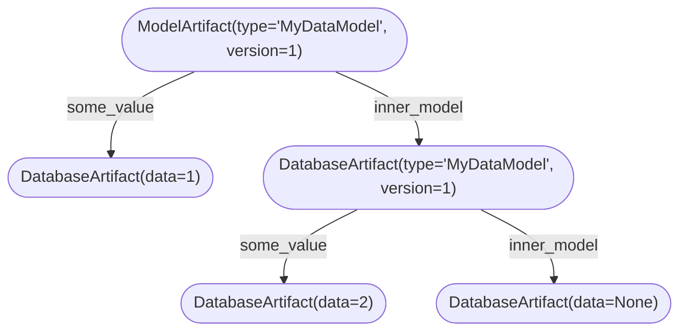

# Schema

Artigraph defines a graph database within [SQLAlchemy](https://www.sqlalchemy.org/)
using the [`Node`](#node) base class.

## Node

All data in Artigraph is stored in a single `artigraph_node` table whose base set of
columns are describe by the `Node` class. Subclasses of `Node` utilize
[single table inheritance](#single-table-inheritance) to extend the table. The columns
defined by the base `Node` class are:

| Column            | Type       | Description                                                  |
| ----------------- | ---------- | ------------------------------------------------------------ |
| `node_id`         | `Integer`  | The primary key of the node.                                 |
| `node_parent_id`  | `Integer`  | The primary key of the node's parent.                        |
| `node_type`       | `String`   | The type of the node (comes from its `polymorphic_identity`) |
| `node_created_at` | `DateTime` | The time the node was created.                               |
| `node_updated_at` | `DateTime` | The time the node was last updated.                          |

The `node_parent_id` column is a foreign key to the `artigraph_node.node_id` column of.
This allows for a tree structure to be built up. The `node_type` column is used to
determine which subclass of `Node` to use when loading a node from the database.

To avoid name collisions, all columns defined by subclasses of `Node` are prefixed with
`node_`. Subclasses of `Node` ought to do the same. For example, the
`artigraph.orm.span.Span` class defines its columns with a `span_` prefix.

### Node Inheritance

Here's an example of what a different `Node` subclass might look like:

```python
from artigraph.orm.node import Node
from sqlalchemy import UniqueConstraint
from sqlalchemy.declarative import Mapped, mapped_column


class MyNode(Node, Mapped):
    __mapper_args__ = {"polymorphic_identity": "my_node"}
    __table_args = (UniqueConstraint("node_parent_id", "my_node_label"),)
    my_node_label: Mapped[str] = mapped_column(nullable=True)
```

Note that even though the type annotation on `my_node_label` is `str`, the column is
marked as nullable. This is because all `Node` subclasses are stored in the same table
and, as such, not all columns will be populated by all rows. Making a column
non-nullable will cause other `Node` class instances to fail to save to the database
since they lack a non-nullable column from another subclass.

Under the hood `artigraph` does two somewhat magical things. First, it inspects the
`__mapper_args__` for the `polymorphic_identity` and saves that as a class attribute
(e.g. `MyNode.polymorphic_identity = "my_node"`). Second, since `__table_args__` cannot
typically be defined on subclasses without a `__tablename__`, as all subclasses of
`Node` must to use single table inheritance, Artigraph shuttles the `__table_args__` to
the `Node` class.

### Single Table Inheritance

Artigraph uses
[single table inheritance](https://docs.sqlalchemy.org/en/14/orm/inheritance.html#single-table-inheritance)
(STI) to store all data in a single table. This comes with advantages and disadvantages
compared to
[concrete table inheritance](https://docs.sqlalchemy.org/en/20/orm/inheritance.html#concrete-table-inheritance).
The primary advantage of STI is that the database schema is drastically simplified since
there's only one table to manage - queries can avoid joins and thus be simpler and,
potentially, more performant. The disadvantages of STI come from a lack of separation -
making independent schema changes may be challenging and, as the number of `Node`
subclasses grows, the table will become more and more sparse.

It's worth keeping these tradeoffs in mind as you extend Artigraph. The main way to
mitigate the disadvantages of STI is to keep the number of `Node` subclasses to a
minimum. Thankfully, the base primitives of Artigraph are powerful enough to support a
wide variety of use cases. In general, if you find yourself needing to add a new

## Base Artifact

`BaseArtifact` is a subclass of [`Node`](#node) that defines a set of columns that are
shared by all artifacts. It does not contain data or describe where data may be found.
Its columns are:

| Column                | Type     | Description                                                      |
| --------------------- | -------- | ---------------------------------------------------------------- |
| `artifact_label`      | `String` | A label for the artifact that is **unique amongst its siblings** |
| `artifact_serializer` | `String` | The name of the serializer used to serialize the artifact.       |

Of note is the `artifact_serializer` which maps to a [serializer](serializers.md) by
name.

### Remote Artifact

`RemoteArtifact` is a subclass of [`BaseArtifact`](#base-artifact) that represents an
artifact that is stored somewhere else other than the database. Since the data itself is
stored elsewhere, all that is stored in the database is a pointer to the artifact. To do
this it defines:

| Column                     | Type     | Description                                         |
| -------------------------- | -------- | --------------------------------------------------- |
| `remote_artifact_storage`  | `String` | The name of the storage backend.                    |
| `remote_artifact_location` | `String` | The location of the data in in the storage backend. |

The `remote_artifact_storage` column maps to a [storage backend](storage.md) by name.

### Database Artifact

`DatabaseArtifact` is a subclass of [`BaseArtifact`](#base-artifact) that stores data
directly in the database. It defines a single column for that purpose:

| Column                   | Type    | Description               |
| ------------------------ | ------- | ------------------------- |
| `database_artifact_data` | `Bytes` | The data of the artifact. |

### Model Artifact

`ModelArtifact` is a subclass of [`DatabaseArtifact`](#database-artifact) that stores
the root node of a [DataModel][artigraph.DataModel].

| Column                   | Type  | Description              |
| ------------------------ | ----- | ------------------------ |
| `model_artifact_type`    | `str` | The name of the model    |
| `model_artifact_version` | `int` | The version of the model |

## Data Model

The [dataclass-like usage of `DataModel`](usage.md#artifact-models) belies the fact that
its underlying implementation builds atop [remote](#remote-artifact) and
[model](#model-artifact) artifacts. Under the hood, the hierarchy of `DataModel`s and
their fields is replicated in the database.

Given an `DataModel` like

```python
class MyDataModel(DataModel, version=1):
    some_value: int
    inner_model: MyDataModel | None = None
```

Saving the following instance

```python
my_data = MyDataModel(some_value=1, inner_model=MyDataModel(some_value=2))
await my_data.create(label="my-data")
```

Will result in the following graph being created in the database



With the table contents below

| node_id | node_parent_id | node_polymorphic_identity | artifact_label | artifact_serializer   | model_artifact_type | model_artifact_version | database_artifact_data        | node_created_at | node_updated_at |
| ------- | -------------- | ------------------------- | -------------- | --------------------- | ------------------- | ---------------------- | ----------------------------- | --------------- | --------------- |
| 1       | null           | model_artifact            | my-data        | artigraph-json-sorted | MyDataModel         | 1                      | {'artigraph_version':'x.y.z'} | ...             | ...             |
| 2       | 1              | database_artifact         | some_value     | artigraph-json        | null                | null                   | 1                             | ...             | ...             |
| 3       | 1              | model_artifact            | inner_model    | artigraph-json-sorted | MyDataModel         | 1                      | {'artigraph_version':'x.y.z'} | ...             | ...             |
| 4       | 3              | database_artifact         | some_value     | artigraph-json        | null                | null                   | 2                             | ...             | ...             |
| 5       | 3              | database_artifact         | inner_model    | artigraph-json        | null                | null                   | null                          | ...             | ...             |
