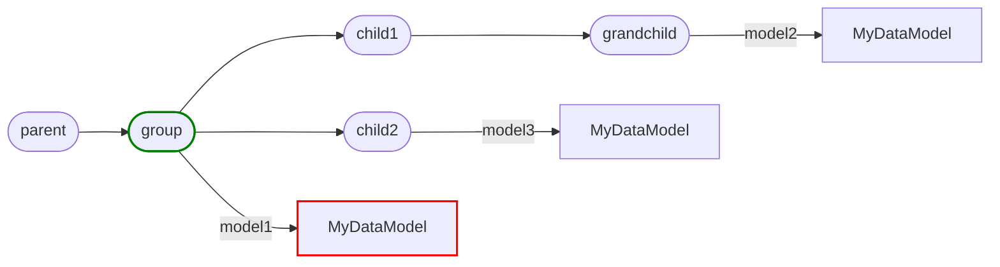

# Usage

There are two main concepts in Artigraph:

-   **Models**: Structured data.
-   **Nodes**: Things models can be attached to.

## Setup

First, you need to set up a SQLAlchemy engine and create the Artigraph tables. The
quickest way to do this is to use the `set_engine` function, pass it a conntection
string, and set `create_tables=True`. You won't need `create_tables=True` if you're
using a database that already has the tables created.

```python
from artigraph import set_engine

set_engine("sqlite+aiosqlite:///example.db", create_tables=True)
```

!!! note

    You'll need to install `aiosqlite` for the above code to work.

Then, you'll need to start up an async event loop. If you're using Jupyter, then you
should already have one running. Otherwise, you can start one like this:

```python
import asyncio
from artigraph import set_engine

set_engine("sqlite+aiosqlite:///example.db", create_tables=True)

async def main():
    # your code here

if __name__ == "__main__":
    asyncio.run(main())
```

All the examples below assume this setup has already been performed.

## Data Models

A `DataModel` is a frozen dataclass that describes the structure of data you want to
save. Instead of using the `@dataclass` decorator, you subclass `DataModel` and declare
the version of your model.

```python
from dataclasses import field
from artigraph import DataModel, create_model


class MyDataModel(DataModel, version=1):
    some_value: int
    another_value: dict[str, str] = field(default_factory=dict)
```

You can then create an instance of the model and save it to the database:

```python
# construct an artifact
model = MyDataModel(some_value=42, another_value={"foo": "bar"})
# save it to the database
await write_model(label="my-data", model=model)
```

Instead of using the `@dataclass` decorator to declare dataclass behavior, pass kwargs
in the class declartion:

```python
class MyDataModel(DataModel, version=1, repr=False, kw_only=True):
    ...
```

### Model Fields

By default the fields of a `DataModel` must be JSON serializable. However, you can
annotated fields in order to indicate other methods for [serializing](serilizers.md) or
[storing](storage.md) them. As an example, you can declare a `pandas.DataFrame`` field
that should be stored in S3:

```python
from typing import Annotated
from artigraph import DataModel, model_field
from artigraph.storage.aws import S3Storage
from artigraph.serializer.pandas import dataframe_serializer

s3_storage = S3Storage("my-bucket")


class MyDataModel(DataModel, version=1):
    frame: Annotated[pd.DataFrame, dataframe_serializer, s3_storage]
```

You can use this to declare reusable `Annotated` types that can be composed together:

```python
from typing import Annotated, TypeVar

import pandas as pd

from artigraph.storage.aws import S3Storage
from artigraph.serializer.pandas import dataframe_serializer
from artigraph.serializer.numpy import numpy_serializer

s3_bucket = S3Storage("my-bucket")

T = TypeVar("T")
S3 = Annotated[T, s3_bucket]
PandasDataframe = Annotated[pd.DataFrame, dataframe_serializer]


class MyDataModel(DataModel, version=1):
    db_frame: PandasDataframe
    s3_frame: S3[PandasDataframe]
```

In the above example, the `db_frame` field will be serialized and stored in the database
as normal. The `s3_frame` field will instead be serialized and stored in S3.

For more info on serializers and storage backends see:

-   [Serializers](serializers.md)
-   [Storage](storage.md)

### Model Migrations

Models are versioned and can be migrated from one version to another. This is useful
when the structure of you model changes. For example, if you have a model like this:

```python
@dataclass
class MyDataModel(DataModel, version=1):
    some_value: int
```

And you want to change it to this:

```python
@dataclass
class MyDataModel(DataModel, version=2):
    renamed_value: int
```

You can define a migration function like so:

```python
@dataclass
class MyDataModel(DataModel, version=2):
    renamed_value: int

    @classmethod
    def model_migrate(cls, version: int, data: dict[str, Any]) -> "MyDataModel":
        if version == 1:
            return cls(renamed_value=data["some_value"])
        else:
            raise ValueError(f"Unknown version: {version}")
```

Now, when you read a model with version 1, it will be automatically converted to the new
version when its read.

Note that this does not write the migrated data to the database. With that said you
could use `model_migrate` to write a migration scripts by reading a series of old models
into the new class definition, saving the migrated data back to the database, and
deleting the old data.

## Nodes

Nodes provide a way to group models together.

```python
from artigraph import new_node, write_node, write_models

node = await write_node(new_node())

await write_models(
    parent_id=node.node_id,
    models={
        "model1": MyDataModel(...),
        "model2": MyDataModel(...),
    }
)
```

You can then retrieve the models attached to a node using `read_models()`:

```python
model_filter = NodeRelationshipFilter(child_of=node.node_id)
models = await read_models(model_filter)
```

To make this easier, you can use `ModelGroup`s. A `ModelGroup` is a context manager that
automatically creates a node and, and the end of the context attaches any models that
were added to it. For example:

```python
from artigraph import ModelGroup, new_node


async with ModelGroup(new_node()) as group:
    group.add_models(
        {
            "training_dataset": DatasetModel(...),
            "test_dataset": DatasetModel(...),
            "trained_model": TrainedModel(...),
        }
    )
```

You can then retrieve artifacts from the group using `read_models()`:

```python
models = await group.read_models()
```

You can also use groups with existing node or node ID:

```python
node_id = 1234
group = ModelGroup(node=node_id)
group.add_model("model1", MyDataModel(...))
await group.save()
models = await group.read_models()
await group.delete_models()
```

### Nesting Nodes

Nodes can be nested to create a hierarchy. For example the following code

```python
from artigraph import ModelGroup, new_node


async with ModelGroup(new_node()) as parent:
    async with ModelGroup(Node) as node:
        async with ModelGroup(Node) as child1:
            async with ModelGroup(Node) as grandchild:
                pass
        async with ModelGroup(Node) as child2:
            pass
```

Will create a node hierarchy like this:


Attaching artifacts to those nested spans:

```python
from artigraph import ModelGroup, new_node


@dataclass
class MyDataModel(DataModel, version=1):
    some_value: int
    another_value: str


async with ModelGroup(new_node()) as parent:
    async with ModelGroup(Node) as group:
        node.add_model("model1", MyDataModel(...))
        async with ModelGroup(Node) as child1:
            async with ModelGroup(Node) as grandchild:
                grandchild.add_model("model2", MyDataModel(...))
        async with ModelGroup(Node) as child2:
            child2.add_model("model3", MyDataModel(...))
```

Would then extend the graph:

<div id="span-graph"></div>


### Querying Nodes

Artigraph makes it easy to inspect the graph using `Filter`s. The examples below show
what nodes each query would return in the [graph above](#span-graph) by highlighting the
nodes in <span style="color:green">green</span> that were used in the query and
<span style="color:red">red</span> for nodes that would be returned.

---

#### Child Nodes

```python
await read_nodes(
    NodeFilter(
        node_type=NodeTypeFilter(type=Node, subclasses=False),
        relationship=NodeRelationshipFilter(child_of=group.node.node_id),
    )
)
```


---

#### Child Models

```python
await read_models(
    ModelFilter(
        model_type=MyDataModel,
        relationship=NodeRelationshipFilter(child_of=group.node.node_id),
    )
)
```



---

#### Descendant Nodes

```python
await read_nodes(
    NodeFilter(
        node_type=NodeTypeFilter(type=Node, subclasses=False),
        relationship=NodeRelationshipFilter(descendant_of=group.node.node_id),
    )
)
```


---

#### Descendant Models

```python
await read_models(
    ModelFilter(
        model_type=MyDataModel,
        relationship=NodeRelationshipFilter(descendant_of=group.node.node_id),
    )
)
```


---

#### Parent Nodes

```python
span_parent = await read_nodes(
    NodeRelationshipFilter(parent_of=group.node.node_id)
)
```


---

#### Ancestor Nodes

```python
grandchild_ancestors = await read_nodes(
    NodeRelationshipFilter(ancestor_or=group.node.node_id)
)
```


### Customizing Nodes

The built-in `Node` is pretty bare bones. If you want to add additional metadata to
spans, you can create a custom span class by subclassing `Node` using SQLAlchemy's
[Singletable Inheritance](https://docs.sqlalchemy.org/en/14/orm/inheritance.html#single-table-inheritance).

```python
from artigraph import Node


class Run(Node):
    __mapper_args__ = {"polymorphic_identity": "run"}
```

Since this uses single table inheritance, all fields from the base `Node` class (from
which `Span` inherits) will need to live in the same table as your custom span. This
means any new columns you add should be nullable, have a default, and have a unique name
that doesn't conflict with any existing columns. The latter is achieved by prefixing the
column name with the name of your custom span class:

```python
from typing import Any
from datetime import datetime
from sqlalchemy import JSON
from sqlalchemy.declarative import Mapped
from artigraph import Node


class Run(Node):
    __mapper_args__ = {"polymorphic_identity": "run"}
    run_started_at: Mapped[datetime]
    run_ended_at: Mapped[datetime | None] = None
```

You can then use your custom span class by passing it to `span_context()`:

```python
from artigraph import create_current
from datetime import datetime, timezone


async def main():
    async with create_current(Run(run_started_at=datetime.now(timezone.utc))):
        ...
```

### Building Upon Nodes

Node are a very flexible abstraction that can be used to build more complex tooling. For
example, you could implement a decorator that automatically creates a `Run` (from the
last section), passes the parent node to the function and automatically sets the start
and end times of the run:

```python
from functools import wraps
from artigraph import write_node_models, read_parent_node
from artigraph.db import current_session


def run(func):
    @wraps(func)
    async def wrapper(*args, **kwargs):

        async with create_current(Run(run_started_at=datetime.now(timezone.utc))) as run:
            try:
                parent = await read_parent_node("current")
                result = await func(parent, *args, **kwargs)
                await write_node_models("current", result)
                return result
            finally:
                async with current_session() as session:
                    run.run_ended_at = datetime.now(timezone.utc)
                    session.add(run)
                    await session.commit()

    return wrapper
```

You could then use this decorator to create `spanned` functions like this:

```python
@spanned
async def train_model(parent_span, **parameters):
    dataset = await read_child_models(parent_span.node_id)
    model = train_model_on_dataset(dataset, **parameters)
    return {"model": model}
```
