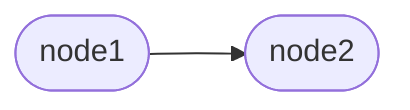
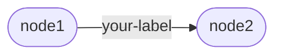

# Usage

This section will go over basic Artigraph usage patterns.

## Setup

First, you need to set up an
[async SQLAlchemy engine](https://docs.sqlalchemy.org/en/20/orm/extensions/asyncio.html#sqlalchemy.ext.asyncio.create_async_engine)
and create the Artigraph tables. The quickest way to do this is to use the
[set_engine()][artigraph.set_engine] function, pass it a conntection string or any
engine object, and set `create_tables=True`. You won't need `create_tables=True` if
you're using a database that already has the tables created.

```python
import artigraph as ag

ag.set_engine("sqlite+aiosqlite:///example.db", create_tables=True)
```

You can also use [current_engine()][artigraph.current_engine] to establish an engine for
use within a particular block of code:

```python
with ag.current_engine("sqlite+aiosqlite:///example.db", create_tables=True):
    # Do stuff with Artigraph
```

!!! note

    You'll need to install `aiosqlite` for the above code to work.

## Nodes

The [Node][artigraph.Node] class forms the backbone of the graphs you'll create with
Artigraph. It represents a single vertex in a graph. You can create a node by
instantiating the class directly:

```python
import artigraph as ag

node = ag.Node()
```

This won't immediately save the node to the database. To do that, you'll need to call
[write_one()][artigraph.write_one].

```python
ag.write_one(node)
```

Or, if you need to write more than one node, you can pass [write()][artigraph.write] a
sequence of nodes.

```python
node1 = ag.Node()
node2 = ag.Node()
ag.write([node1, node2])
```

## Links

[NodeLink][artigraph.NodeLink] objects are the edges that connect nodes in a graph. To
create one you'll need at least two node. You can then pass their IDs to the
constructor:

```python
import artigraph as ag

node1 = ag.Node()
node2 = ag.Node()

link = ag.NodeLink(parent_id=node1.node_id, child_id=node2.node_id)
```

Which will form the following relationship:



Node links can also have a label that describes the relationship between the nodes:

```python
link = ag.NodeLink(
    parent_id=node1.node_id,
    child_id=node2.node_id,
    label="your-label",
)
```

That have a labeled edge between them:



You can then write them all to the database:

```python
ag.write([node1, node2, link])
```

## Artifacts

An [Artifact][artigraph.Artifact] is a node in the graph that additionally has a value.
Without specifying anything extra, values are limited to byte strings:

```python
import artigraph as ag

artifact = ag.Artifact(value=b"Hello, world!")
```

To store other types of data, you'll need to declare a [serializer](./serializers.md):

```python
json_artifact = ag.Artifact(value={"hello": "world"}, serializer=ag.json_serializer)
```

You can then write the artifact to the database:

```python
ag.write_one(artifact)
```

As with nodes, you can relate them with each other or with other nodes using node links:

```python
node = ag.Node()
artifact = ag.Artifact(value=b"Hello, world!")
link = ag.NodeLink(parent_id=node.node_id, child_id=artifact.node_id)

ag.write([node, artifact, link])
```

Some data is too large to store directly in the database. For that, you can specify a
separate [storage](./storage.md) location:

```python
file_storage = ag.FileSystemStorage("path/to/storage/dir")

large_artifact = ag.Artifact(
    value={"really": "big", "data": "here"},
    serializer=ag.json_serializer,
    storage=file_storage,
)
```

## Models

A [GraphModel][artigraph.GraphModel] gives structure to the data in your artifacts. The
easiest way to create one is using the built-in [@dataclass][artigraph.dataclass]
decorator, though [other implementations](./models.md#built-in-models) exist. The only
difference between this decorator and the standard library version is that it must be
used on a subclass of `GraphModel` which requires a version (which will be discussed
later). With that in mind, you can define a model like so:

```python
import artigraph as ag


@ag.dataclass
class Person(ag.GraphModel, version=1):
    name: str
    age: int
```

You can then create an instance of the model and write it to the database:

```python
person = Person(name="John Doe", age=42)
ag.write_one(person)
```

You'll note here that you didn't have to specify a serializer for non-bytes values.
That's because, by default, the fields of a dataclass `GraphModel` are serialized using
the built-in JSON serializer. For fields that are not JSON-serializable or which require
external storage, you'll need to annotate them with this information using
[`typing.Annotated`](https://docs.python.org/3/library/typing.html#typing.Annotated):

```python
from datetime import datetime
from typing import TypeVar, Annotated

import artigraph as ag

T = TypeVar("T")

DateTime = Annotated[datetime, ag.datetime_serializer]
StoreFile = Annotated[T, ag.FileSystemStorage("path/to/storage/dir")]


@ag.dataclass
class Person(ag.GraphModel, version=1):
    name: str
    age: int
    birthday: DateTime
    photo: StoreFile[bytes]


person = Person(
    name="John Doe",
    age=42,
    birthday=datetime(1979, 1, 1),
    photo=b"a really big photo",
)

ag.write_one(person)
```

## Async

Artigraph is designed to be used in both a synchronous or asynchronous context. Many
functions and methods are dual-use and can be called either way. One such function is
[artigraph.write()][artigraph.write]. Synchronous use looks like this:

```python
ag.write(...)
```

While asynchronous use looks like this:

```python
import asyncio


async def main():
    await ag.write(...)


asyncio.run(main())
```

This is similarly true for many context managers. For example, the
[current_session()][artigraph.current_session] context manager can be used
synchronously:

```python
with ag.current_session() as session:
    ...
```

Or asynchronously:

```python
import asyncio


async def main():
    async with ag.current_session() as session:
        ...


asyncio.run(main())
```

To force Artigraph to use version you need only access the `.a` or `.s` attributes of
the function you're calling to get the async or sync version respectively. In the
examples above `write.s` is the sync version and `write.a` is the async version.

Being able to be explicit about whether you're using a sync or async version of a
function can also be useful when working with type checkers since the return type of the
dual-use function (without the `.a` or `.s`) will be the union `Awaitable[T] | T` where
`T` is the return type of the function.

A non-exhaustive list of dual-use functions, methods and context managers is below:

-   [exists()][artigraph.exists]
-   [read()][artigraph.read]
-   [read_one()][artigraph.read_one]
-   [write()][artigraph.write]
-   [write_one()][artigraph.write_one]
-   [delete()][artigraph.delete]
-   [delete_one()][artigraph.delete_one]
-   [delete_many()][artigraph.delete_one]
-   [current_session()][artigraph.current_session]
