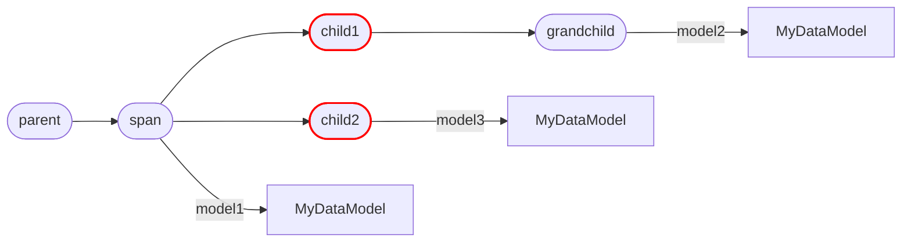

# Usage

There are two main concepts in Artigraph:

-   **Artifact Models**: A dataclass that defines the structure of an artifact.
-   **Spans**: A context used to group artifacts that were produced together.

!!! note

    All examples in this section assume they're running in a script like this one

    ```python
    import asyncio
    from artigraph import set_engine

    set_engine("sqlite+aiosqlite:///example.db", create_tables=True)

    ...  # the example code

    if __name__ == "__main__":
        asyncio.run(main())
    ```

## Artifact Models

An `ArtifactModel` is a dataclass that describes the structure of an artifact. It is
defined by subclassing `ArtifactModel` and a version number that can be used to
[migrate](#artifact-migrations) from one version of the model to another.

```python
from dataclasses import dataclass, field
from artigraph import ArtifactModel


@dataclass
class MyDataModel(ArtifactModel, version=1):
    some_value: int
    another_value: dict[str, str] = field(default_factory=dict)
```

You can then create an instance of the model and save it to the database:

```python
async def main():
    # construct an artifact
    artifact = MyDataModel(some_value=42, another_value={"foo": "bar"})
    # save it to the database
    artifact_id = await artifact.create(label="my-data")
```

### Artifact Fields

Artifacts can have any number of fields of any type. By default, so long as the field is
JSON serializable, you don't need to take any special action to save it to the database.
However, you may need to store a field in a different format or in a separate location
outside the database. To do this, you can use an `artifact_field()`.

An `artifact_field` allows you to specify a serializer and/or a storage location for a
field's value. For example, you might have a Pandas DataFrame that you want to store in
S3. This can be done like so:

```python
from dataclasses import dataclass
from artigraph import ArtifactModel, artifact_field
from artigraph.storage.aws import S3Storage
from artigraph.serializer.pandas import dataframe_serializer

s3_storage = S3Storage("my-bucket")


@dataclass
class MyDataModel(ArtifactModel, version=1):
    dataframe: pd.DataFrame = artifact_field(
        serializer=dataframe_serializer,
        storage=s3_storage,
    )
```

If you leave out the `storage` argument, the serialized value will be stored in the
database as normal. If you leave out the `serializer` argument, `artigraph` will do its
best to infer how to serialize the value based on its type. In general, if in doubt, you
should specify a serializer to ensure consistent behavior.

For more info on serializers and storage backends see:

-   [Serializers](serializers.md)
-   [Storage](storage.md)

### Artifact Migrations

Artifacts are versioned and can be migrated from one version to another. This is useful
when the structure of an artifact changes over time. For example, if you have a model
like this:

```python
@dataclass
class MyDataModel(ArtifactModel, version=1):
    some_value: int
```

And you want to change it to this:

```python
@dataclass
class MyDataModel(ArtifactModel, version=2):
    renamed_value: int
```

You can define a migration function like this:

```python
@dataclass
class MyDataModel(ArtifactModel, version=2):
    renamed_value: int

    @classmethod
    def migrate(cls, version: int, data: dict[str, Any]) -> "MyDataModel":
        if version == 1:
            return cls(renamed_value=data["some_value"])
        else:
            raise ValueError(f"Unknown version: {version}")
```

Now, when you read an artifact with version 1, it will be automatically converted to the
new version. You can also use this to implement migration scripts by reading a series of
old artifacts into the new version, saving them back to the database, and deleting the
old artifacts.

## Spans

Spans are a way to group artifacts that were produced together. For example, if you have
a model that was trained on a dataset, you might want to group the model and the dataset
together in a span. Spans can be created using the `span_context()` manager:

```python
from artigraph import span_context, create_span_artifact


async def main():
    async with span_context(label="training"):
        await create_span_artifact(
            "current", label="data", data=TrainingDataset(...)
        )
        await create_span_artifact(
            "current", label="model", data=TrainedModel(...)
        )
```

You can then retrieve artifacts from a spans using `read_span_artifact()`:

```python
from artigraph import read_span_artifact


async def main():
    async with span_context(label="training") as span:
        await create_span_artifact(
            "current", label="data", data=TrainingDataset(...)
        )
        await create_span_artifact(
            "current", label="model", data=TrainedModel(...)
        )
    # read the data back from the spans
    model = await read_span_artifact(span.node_id, label="model")
    dataset = await read_span_artifact(span.node_id, label="dataset")
```

### Nesting Spans

Spans can be nested to create a hierarchy of spans. For example the following code

```python
from artigraph import span_context


async def main():
    async with span_context(label="parent"):
        async with span_context(label="span"):
            async with span_context(label="child1"):
                async with span_context(label="grandchild"):
                    pass
            async with span_context(label="child2"):
                pass
```

Will create a span hierarchy like this:


Attaching artifacts to those nested spans:

```python
from artigraph import span_context


@dataclass
class MyDataModel(ArtifactModel, version=1):
    some_value: int
    another_value: str


async def main():
    async with span_context(label="parent"):
        async with span_context(label="span"):
            await create_span_artifact(
                "current", label="model1", data=MyDataModel(...)
            )
            async with span_context(label="child1"):
                async with span_context(label="grandchild"):
                    await create_span_artifact(
                        "current", label="model2", data=MyDataModel(...)
                    )
            async with span_context(label="child2"):
                await create_span_artifact(
                    "current", label="model3", data=MyDataModel(...)
                )
```

Would then extend the graph:

<div id="span-graph"></div>


### Querying Spans

Artigraph provides a number of utilities that allow you to traverse the span hierarchy
and retrieve artifacts from the spans. The examples below show what nodes each query
would in the [graph above](#span-graph) return by highlighting them in red.

---

#### Child Spans

```python
span_children = await read_child_spans(span.node_id)
```



---

#### Child Artifacts

```python
span_child_artifacts = await read_child_artifacts(span.node_id)
```


---

#### Descendant Spans

```python
span_descendants = await read_descendant_spans(span.node_id)
```


---

#### Descendant Artifacts

```python
span_descendant_artifacts = await read_descendant_artifacts(span.node_id)
```


---

#### Parent Span

```python
span_parent = await read_parent_span(span.node_id)
```


---

#### Ancestor Spans

```python
grandchild_ancestors = await read_ancestor_spans(grandchild.node_id)
```


### Customizing Spans

The built-in `Span` it pretty bare bones. If you want to add additional metadata to
spans, you can create a custom span class by subclassing `Span` using SQLAlchemy's
[Singletable Inheritance](https://docs.sqlalchemy.org/en/14/orm/inheritance.html#single-table-inheritance).
To declare the polymorphic identity of your new span, simply declare a
`polymorphic_identity` class attribute:

```python
from artigraph import Span


class CustomSpan(Span):
    polymorphic_identity = "custom_span"
```

Since this uses single table inheritance, all fields from the base `Node` class (from
which `Span` inherits) will need to live in the same table as your custom span. This
means any new columns you add should be nullable, have a default, and have a unique name
that doesn't conflict with any existing columns. The latter is achieved by prefixing the
column name with the name of your custom span class:

```python
from typing import Any
from artigraph import Span
from sqlalchemy import JSON
from sqlalchemy.declarative import Mapped, mapped_columns


class CustomSpan(Span):
    polymorphic_identity = "custom_span"
    custom_span_metadata: Mapped[Any] = mapped_column(JSON, default=None)
```

You can then use your custom span class by passing it to `span_context()`:

```python
from artigraph import span_context


async def main():
    async with span_context(CustomSpan(custom_span_metadata={...})) as span:
        ...
```

### Building Upon Spans

Spans are a very flexible abstraction that can be used to build more complex tooling.
For example, you could implement a decorator that automatically creates a span, passes
the parent span to the function so it can read its data, and saves the function's return
values as artifacts:

```python
from functools import wraps
from artigraph import span_context, create_span_artifacts, read_parent_span


def spanned(func):
    @wraps(func)
    async def wrapper(*args, **kwargs):
        async with span_context(label=func.__name__):
            parent_span = await read_parent_span("current")
            result = await func(parent_span, *args, **kwargs)
            await create_span_artifacts("current", result)
            return result

    return wrapper
```

You could then use this decorator to create `spanned` functions like this:

```python
@spanned
async def train_model(parent_span, **parameters):
    dataset = await read_span_artifact(parent_span.node_id, label="dataset")
    model = train_model_on_dataset(dataset, **parameters)
    return {"model": model}
```
